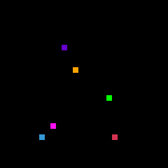
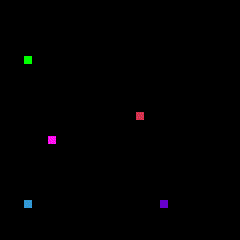
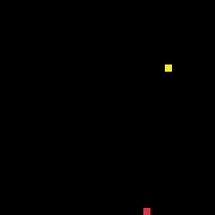
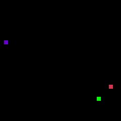
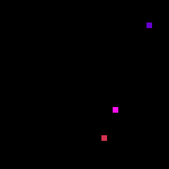

# Snake Game Pathfinding

## Introduction

Python source code for testing different pathfinding algorithms against eachother in a "Snake Game" environment.

Due to the nature of the Snake Game, the path of each snake is calculated each frame, with only the first move used before
the path is calculated again; repeat.

  
  
   
  
  
   
  
  
   
  
  <i>Sample results</i>

